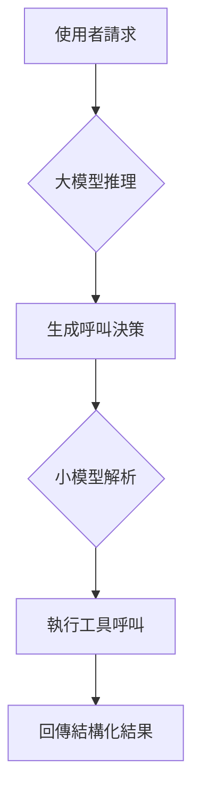

## 大模型api為什麼需要具備工具呼叫能力？
大多數的agent框架或者mcp客戶端需要模型api支援工具呼叫能力

## 直接工具呼叫和間接工具呼叫
- 直接工具呼叫
  
api回傳的結果中有字段專門存儲工具呼叫的結果
- 間接工具呼叫
  
在提示詞中讓模型按照給定格式回傳工具呼叫的結果，然後從content中解析出工具參數和名稱
```
ChatCompletion(id='0196bea6713a7620552a143e3aa91f93', choices=[Choice(finish_reason='tool_calls', index=0, logprobs=None, message=ChatCompletionMessage(content='', refusal=None, role='assistant', annotations=None, audio=None, function_call=None, tool_calls=[ChatCompletionMessageToolCall(id='0196bea67535a49350b2ab4b41a7e588', function=Function(arguments='{"location": "北京市"}', name='get_current_weather'), type='function')]))], created=1746955301, model='Qwen/Qwen2.5-7B-Instruct', object='chat.completion', service_tier=None, system_fingerprint='', usage=CompletionUsage(completion_tokens=22, prompt_tokens=273, total_tokens=295, completion_tokens_details=None, prompt_tokens_details=None))
```

## 實作流程
