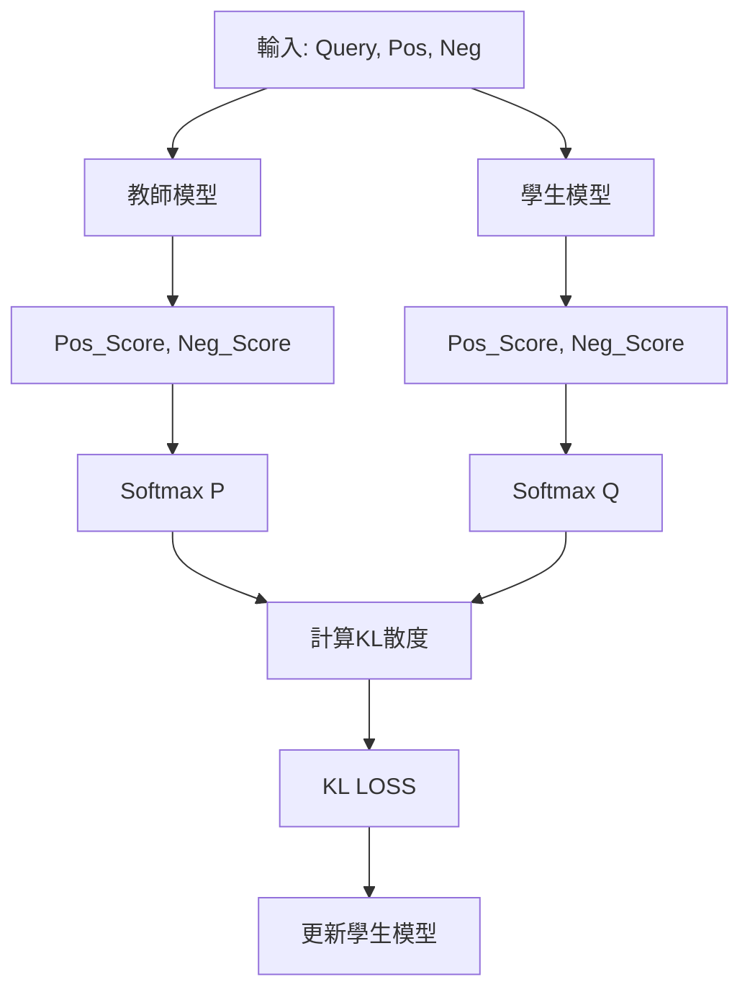

# EMBEDDING蒸餾
## 蒸餾原理

## 資料集說明
- origin_data: 原始資料集(包含訓練集和驗證集)
- processed_data: 處理後的訓練資料(qyery, pos, neg)，正樣本單條，負樣本單條或多條（隨機抽樣）
- train_data: 教師模型生成的訓練資料（包含正負樣本及其分數）

## 程式碼說明
- data_process.py: 處理原始資料集，使用全部正樣本，對負樣本進行抽樣，儲存為processed_data資料夾
- get_distillation_data_local.py: 載入本地模型，由教師模型生成蒸餾資料，儲存在train_data資料夾
- get_distillation_data_openai.py: 載入openai模型服務，由教師模型生成蒸餾資料，儲存在train_data資料夾
- train.py: 訓練程式碼
- merge.py: 合併lora權重
- evaluation.py: 驗證集評估模型效果

## 注意事項
合併完lora權重之後，需要將原始模型權重檔案中的如下檔案拷貝至合併權重之後的資料夾
- 1_Pooling
- config_sentence_transformers.json
- configuration.json
- generator_config.json
- modules.json

原因是qwen3-embedding原始模型使用last token的向量作為句子向量，在訓練中使用的也是last token，如果缺少上述檔案，使用sentence_transformers評估載入模型時會預設使用所有token的平均向量作為句子向量，訓練和測試不一致會導致測試效能低於原始模型

## 模型效果

| 模型名稱                                | MAP       | MRR@10    | NDCG@10   |
|-------------------------------------|-----------|-----------|-----------|
| 教師模型 Qwen3-Embedding-4B          | 0.8887    | 0.9710    | 0.9226    |
| 教師模型 Qwen3-Embedding-8B          | 0.8940    | 0.9710    | 0.9272    |
| 學生模型 Qwen3-Embedding-0.6B        | 0.8536    | 0.9545    | 0.8955    |
| 蒸餾後（LoRA，負樣本數10，T=1，教師模型4B）  | 0.8785    | 0.9630    | 0.9150    |
| 蒸餾後（全參，負樣本數10，T=2，教師模型4B）  | 0.8757    | 0.9632    | 0.9139    |
| 蒸餾後（LoRA，負樣本數1，T=1，教師模型4B）   | 0.8730    | 0.9599    | 0.9117    |
| 蒸餾後（LoRA，負樣本數1，T=1，教師模型8B）   | 0.8719    | 0.9620    | 0.9116    |

## 模型資料連接
https://pan.quark.cn/s/4c82c4d253ac
