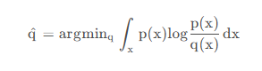
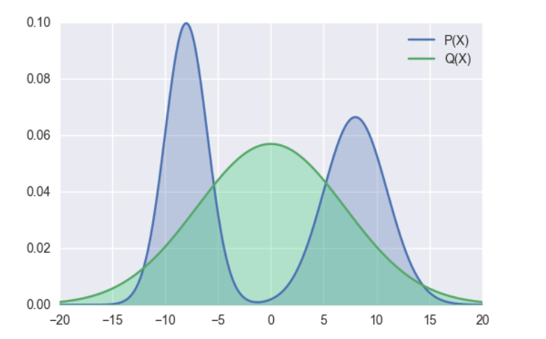
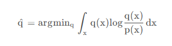
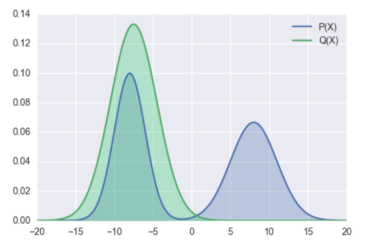

## 原理
將待壓縮的模型作為教師模型，將體積更小的模型作為學生模型，讓學生模型在教師模型的監督下進行優化，將學生模型學習到教師模型的機率分佈，透過kl散度進行控制。
## 方法
對於大模型的知識蒸餾，主要分為兩種：
### 其一、黑盒知識蒸餾。
使用大模型生成資料，透過這些資料去微調更小的模型，來達到蒸餾的目的。缺點是蒸餾效率低，優點是實作簡單。
### 其二、白盒知識蒸餾。
取得學生模型和教師模型的輸出機率分佈（或者中間隱藏層的機率分佈），透過kl散度將學生模型的機率分佈向教師模型對齊。
下面主要介紹和測試白盒知識蒸餾：
白盒知識蒸餾主要在於模型分佈的對齊，模型分佈對齊主要依賴kl散度，對於kl散度的使用又有如下幾種方式：
#### 其一、前向kl散度。
也就是我們經常說的kl散度。\
\
p為教師模型的機率分佈，q為學生模型的機率分佈，minillm論文中提到前向kl散度可能會使學生模型高估教師模型中機率比較低的位置，結合公式來看，當p增大時，為了使得kl散度小，則q也需要增大，但是當p趨於0時，無論q取任何值，kl散度都比較小，因為此時p(x)log((p(x)/q(x)))的大小主要受p(x)控制，這樣起不到優化q分佈的效果，可能會使q分佈高估p分佈中機率低的位置。
下圖展示了前向kl散度的擬合情況，前向kl散度是一種均值搜索，更傾向於擬合多峰

#### 其二、反向kl散度。
為了緩解前向kl散度的缺點，提出了反向kl散度。\
\
p為教師模型的機率分佈，q為學生模型的機率分佈，當p趨於零時，為了使kl散度小，q也需趨於0。
minillm論文中說對於大模型的知識蒸餾，反向kl散度優於前向kl散度，但是也有其他論文說反向kl散度不一定比前向kl散度更優，實際選擇中，可能要基於實驗驅動。
反向kl散度是一種模式搜索，更傾向於擬合單個峰

#### 其三、偏向前kl散度。
對學生模型的分佈和教師模型的分佈進行加權作為學生模型的分佈。
#### 其四、偏向反kl散度。
對學生模型的分佈和教師模型的分佈進行加權作為教師模型的分佈。
## 三、測試
qwen2.5-3b作為教師模型，qwen2.5-0.5b作為學生模型\
流程如下：\
1、將qwen2.5-3b模型在指定資料集上微調（訓練資料5000條，測試資料1000條，測試準確度為81.1%）\
2、探索如下三種方案下的蒸餾效果（均使用前向kl散度）：\
2.1 不微調學生模型+kl散度損失\
蒸餾1個epoch，準確度70.5%\
蒸餾2個epoch，準確度73%\
2.2 微調學生模型（模型準確度80.3%）+kl散度損失\
蒸餾2個epoch，準確度61.9%\
2.3 不微調學生模型+kl散度損失和交叉熵損失加權\
蒸餾2個epoch，70.5%\
3、上述實驗中只使用kl散度的效果最好，如下實驗中使用kl散度的變種進行測試，經過測試，效果都不如前向kl散度效果好。\
3.1 反向kl散度\
準確率只有54%\
3.2 偏向前向kl散度\
損失下降異常，效果很差，不斷重複輸出。\
由於資源和時間的限制，所有測試均保持相同的超參數，未針對不同損失設定不同超參數。

## on policy disillation
### 直接優化kl散度
python on_policy_distillation_train.py
### rl
python on_policy_distillation_train_rl.py
