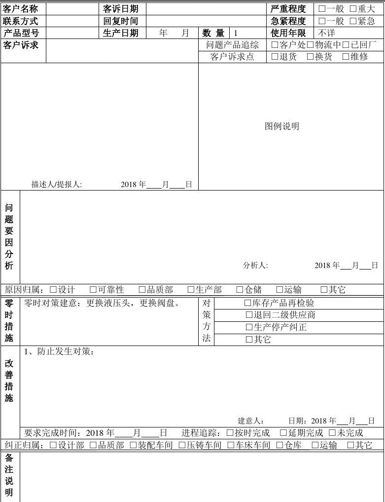
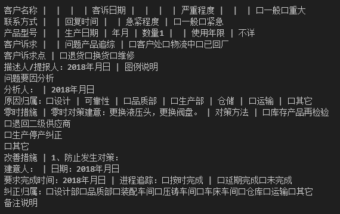

# table2txt

## 介紹
支援圖片或者pdf中的普通文本提取和表格中文本的提取(pdf需要先轉成圖片)，並保持其結構化排版佈局（儘量保持其結構，不完美）

可參考如下示例：

需要提取的圖片：

提取之後：

## 使用方法

1、下載模型

modelscope下載表格提取模型，並修改程式碼中相關路徑

https://modelscope.cn/models/iic/cv_dla34_table-structure-recognition_cycle-centernet

2、修改程式碼中需要提取的圖片路徑

## 注意

有時會出現調整完座標之後的效果圖片無法繪製的情況，可忽略，文字可正常提取

程式碼中有不完善的地方，可根據需要自行修改
